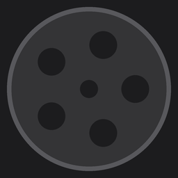

<p align="center">
  
</p>

<h1 align="center">Crooner</h1>
<p align="center"><em>A most distinguished apparatus for the capture of moving pictures upon the Macintosh computing machine.</em></p>

<p align="center">
  
  
  
</p>

---

## Hear ye, hear ye

In this modern age of wonders, when a gentleman or lady of industry finds themselves in want of recording their computing labours for the edification of colleagues near and far, **Crooner** stands ready to oblige.

Residing quietly in your menu bar — troubling neither your Dock nor your concentration — Crooner springs to life upon demand, captures your screen in vivid fidelity, and retires gracefully when the performance is concluded. No subscription. No cloud. No funny business. Your recordings are yours alone, deposited directly into your `~/Movies` folder like a well-addressed postal parcel.

---

## Principal Features

**Screen Capture of the Highest Order**
Record your full display, a single window, or a hand-drawn region of the screen — selected with the same care one might apply to framing a portrait.

**The Webcam Bubble**
A circular cameo of your countenance, composited directly into the picture at a corner of your choosing. Small, medium, or large — the appropriate scale for any occasion.

**A Rousing Accompaniment**
Both your microphone narration and the sounds emanating from the machine itself are recorded and blended into a single harmonious audio track.

**The Floating Control Bar**
A tasteful pill-shaped apparatus floats above your work during recording, offering the facilities of pause, microphone silence, and conclusion — all without disturbing the scene being captured.

**Pause and Resume**
Should you require a brief intermission, Crooner obliges. The pause is cut cleanly from the final picture; your audience need never know.

**A Notification Upon Completion**
When the final reel is wound, a notification is dispatched bearing the name of your recording and offering to reveal it in the Finder forthwith.

**Settings of Substance**
Codec (H.264 or HEVC), frame rate (30 or 60 fps), save location, audio volumes, webcam defaults, countdown duration, and launch-at-login — all persisted faithfully between sessions.

---

## System Requirements

| Requirement | Specification |
|---|---|
| Operating System | macOS Ventura 13.0 or later |
| Architecture | Apple Silicon or Intel |
| Permissions | Screen Recording, Camera, Microphone |

---

## Installation

### From a GitHub Release *(recommended)*

1. Download the latest `Crooner-x.x.x.dmg` from the [Releases](../../releases) page
2. Open the disk image and drag **Crooner.app** to your Applications folder
3. Launch Crooner — it will take up residence in your menu bar
4. Grant the three permissions when prompted

### Building from Source

The following provisions are required:

```bash
brew install xcodegen
```

Then, from the project directory:

```bash
xcodegen generate
open Crooner.xcodeproj
```

Build and run in Xcode. Sign with your own development certificate as you see fit.

---

## A Brief Tutorial in the Operation of the Apparatus

1. **Click the film reel** in the menu bar to open the recording panel
2. **Select your source** — full screen, a window, or a drawn area
3. **Toggle the webcam bubble** if you wish to appear on screen
4. **Press Record** — a brief countdown commences, then capture begins
5. The control bar materialises above your work; use it to pause, mute, or stop
6. Upon stopping, a notification heralds the saved file and offers to present it in the Finder
7. The Recordings tab in the menu bar panel also bears a direct link

---

## Technical Composition

Crooner is constructed entirely in native Swift, with no external dependencies, no network traffic, and no runtime surprises.

| Component | Technology |
|---|---|
| Screen capture | ScreenCaptureKit |
| Webcam capture | AVFoundation / AVCaptureSession |
| Audio mixing | AVAudioEngine |
| Compositing | Core Image (Metal-backed) |
| Encoding | AVAssetWriter (H.264 / HEVC + AAC) |
| UI | SwiftUI + AppKit |

---

## Releasing a New Version

Open a pull request in the customary fashion. Before merging, affix one of the following labels to declare the nature of the occasion:

| Label | Effect |
|---|---|
| `release: patch` | Bug fixes and minor corrections — `x.y.Z+1` |
| `release: minor` | New features, backwards-compatible — `x.Y+1.0` |
| `release: major` | Breaking changes of consequence — `X+1.0.0` |

Upon merging, GitHub Actions will determine the next version, affix the appropriate tag, and proceed to build, sign, notarise, package, and publish the DMG to the Releases page — entirely unattended. You need not lift a further finger.

Should you need to re-run the build for an existing tag (in the event of some mechanical misfortune), visit **Actions → Release → Run workflow** and supply the tag name.

---

## Licence

MIT. Do with it what you will, though we trust you shall comport yourself admirably.

---

<p align="center"><em>"The moving image — captured, preserved, and delivered — with all the dignity the occasion deserves."</em></p>
